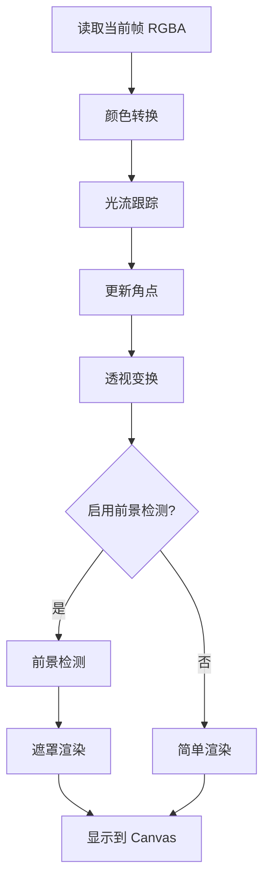

# 核心算法清单

本项目使用的所有计算机视觉算法及其执行顺序。

---

## 📚 算法索引

### 1. 特征检测算法
- **Shi-Tomasi 角点检测** (`cv.goodFeaturesToTrack`)

### 2. 光流跟踪算法
- **金字塔 Lucas-Kanade 光流** (`cv.calcOpticalFlowPyrLK`)

### 3. 几何变换算法
- **透视变换矩阵计算** (`cv.getPerspectiveTransform`)
- **透视变换应用** (`cv.warpPerspective`)

### 4. 前景检测算法
- **颜色空间转换** (`cv.cvtColor`)
- **帧差法** (`cv.absdiff`)
- **二值化阈值** (`cv.threshold`)
- **形态学膨胀** (`cv.dilate`)
- **高斯模糊** (`cv.GaussianBlur`)

### 5. 渲染算法
- **Alpha 通道混合** (手动实现)

---

## 🔄 算法执行流程

### 阶段 1: 初始化（标记完成后，仅执行一次）

```
用户标记 4 个角点
    ↓
【特征检测】cv.goodFeaturesToTrack()
    ├─ 输入: 第一帧灰度图 + 4 个角点区域掩码
    ├─ 输出: 100 个特征点坐标 (x, y)
    └─ 作用: 在角点周围找到易于跟踪的特征点
```

---

### 阶段 2: 每帧处理（主循环）



#### 2.1 颜色空间转换
```
【算法】cv.cvtColor()
输入: 当前帧 (RGBA, 854x480x4)
输出: 灰度图 (Gray, 854x480x1)
参数: cv.COLOR_RGBA2GRAY
作用: 光流算法需要灰度图像
```

#### 2.2 光流跟踪
```
【算法】cv.calcOpticalFlowPyrLK()
输入:
  - prevGray: 前一帧灰度图
  - currentGray: 当前帧灰度图
  - prevFeatures: 前一帧的 100 个特征点
输出:
  - nextFeatures: 当前帧的 100 个特征点新位置
  - status: 每个点的跟踪状态 (1=成功, 0=失败)
  - err: 每个点的误差值
参数:
  - winSize: 21x21 (搜索窗口)
  - maxLevel: 3 (金字塔层数)
  - criteria: 30 次迭代或误差 < 0.01
作用: 跟踪特征点在帧间的运动
```

#### 2.3 角点更新
```
【算法】平均偏移法（自定义）
输入: 100 个特征点的新旧位置
输出: 4 个角点的新位置
计算:
  1. 计算每个成功跟踪点的偏移量 (dx, dy)
  2. 求平均偏移: avgDx = Σdx / count, avgDy = Σdy / count
  3. 应用到所有角点: newCorner = oldCorner + (avgDx, avgDy)
  4. 3 帧移动平均平滑: smoothed = (frame[t] + frame[t-1] + frame[t-2]) / 3
作用: 将特征点运动转化为角点运动，抑制抖动
```

#### 2.4 透视变换
```
【算法 1】cv.getPerspectiveTransform()
输入:
  - srcPoints: 广告图片的 4 个角 [(0,0), (w,0), (w,h), (0,h)]
  - dstPoints: 视频中跟踪的 4 个角
输出: 3x3 单应性矩阵 M
数学: 解方程组 M * srcPoints = dstPoints
作用: 计算从广告平面到视频平面的映射

【算法 2】cv.warpPerspective()
输入:
  - adMat: 广告图像 (RGBA)
  - M: 透视变换矩阵
  - dsize: 输出尺寸 (854x480)
输出: 变形后的广告图像 (RGBA, 854x480)
参数:
  - interpolation: cv.INTER_LINEAR (双线性插值)
  - borderMode: cv.BORDER_CONSTANT
  - borderValue: (0,0,0,0) 透明
作用: 将广告图像投影到跟踪区域
```

#### 2.5 前景检测（可选）

##### 2.5.1 帧差法
```
【算法】cv.absdiff()
输入:
  - prevGray: 前一帧灰度图
  - currentGray: 当前帧灰度图
输出: diff 差异图像
计算: diff[i,j] = |currentGray[i,j] - prevGray[i,j]|
作用: 检测运动区域
```

##### 2.5.2 二值化
```
【算法】cv.threshold()
输入: diff 差异图像
输出: mask 二值遮罩
参数:
  - thresh: motionThreshold (默认 25)
  - maxval: 255
  - type: cv.THRESH_BINARY
计算: mask[i,j] = (diff[i,j] > thresh) ? 255 : 0
作用: 将运动区域标记为白色 (255)，静止区域为黑色 (0)
```

##### 2.5.3 形态学膨胀
```
【算法】cv.dilate()
输入: mask 二值遮罩
输出: 膨胀后的 mask
参数:
  - kernel: 椭圆形结构元素 (dilateSize x dilateSize)
计算: 对每个像素，用核覆盖区域，取最大值
作用: 填补遮罩中的小孔，连接分散区域
```

##### 2.5.4 高斯模糊
```
【算法】cv.GaussianBlur()
输入: mask 遮罩
输出: 模糊后的 mask
参数:
  - ksize: (blurSize x blurSize)，必须是奇数
  - sigma: 0 (自动计算)
计算: 每个像素与周围像素的高斯加权平均
作用: 平滑遮罩边缘，使过渡自然
```

#### 2.6 Alpha 混合渲染

##### 简单渲染（无前景检测）
```
【算法】Alpha 混合（手动实现）
输入:
  - videoFrame: 原始视频帧 (RGBA)
  - warpedAd: 变形后的广告 (RGBA)
输出: result 合成图像
计算（对每个像素）:
  alpha = warpedAd[i,j].alpha / 255.0
  if (alpha > 0.1):
    for c in [R,G,B]:
      result[i,j][c] = videoFrame[i,j][c] * (1 - alpha)
                     + warpedAd[i,j][c] * alpha
作用: 将广告叠加到视频上
```

##### 遮罩渲染（启用前景检测）
```
【算法】遮罩 Alpha 混合（手动实现）
输入:
  - videoFrame: 原始视频帧
  - warpedAd: 变形后的广告
  - mask: 前景遮罩
输出: result 合成图像
计算（对每个像素）:
  adAlpha = warpedAd[i,j].alpha / 255.0
  maskValue = mask[i,j] / 255.0  # 前景置信度
  backgroundConfidence = 1.0 - maskValue  # 背景置信度

  if (adAlpha > 0.1 && backgroundConfidence > 0.5):
    finalAlpha = adAlpha * backgroundConfidence
    for c in [R,G,B]:
      result[i,j][c] = videoFrame[i,j][c] * (1 - finalAlpha)
                     + warpedAd[i,j][c] * finalAlpha
作用: 只在背景区域叠加广告，规避前景运动物体
```

---

## 📊 算法性能分析

### 每帧计算量（854x480 分辨率）

| 算法 | 复杂度 | 耗时估计 | 瓶颈 |
|------|--------|----------|------|
| 颜色转换 | O(n) | ~1ms | 低 |
| 光流跟踪 | O(k·p·l) | ~15ms | ⚠️ 高 |
| 角点更新 | O(k) | <1ms | 低 |
| 透视变换矩阵 | O(1) | <1ms | 低 |
| 透视变换应用 | O(n) | ~5ms | 中 |
| 帧差法 | O(n) | ~1ms | 低 |
| 阈值化 | O(n) | ~1ms | 低 |
| 膨胀 | O(n·k²) | ~3ms | 中 |
| 高斯模糊 | O(n·k²) | ~3ms | 中 |
| Alpha 混合 | O(n) | ~10ms | ⚠️ 高 |

**符号说明**：
- n = 像素数 (854×480 = 409,920)
- k = 特征点数 (100)
- p = 搜索窗口大小 (21×21)
- l = 金字塔层数 (3)

**总处理耗时**（启用前景检测）：**约 40ms** → **实际帧率约 25 FPS**

**注意**：
- 这是**算法处理耗时**，不是帧间隔
- 使用 `requestAnimationFrame` 但处理太慢，实际达不到 60 FPS
- 详见 [requestAnimationFrame 与帧率详解](RAF_AND_FPS.md)

**性能瓶颈**：
1. 🔴 **光流跟踪**：15ms，占 37.5%
2. 🟡 **Alpha 混合**：10ms，占 25%

---

## 🧮 核心算法数学原理

### 1. Shi-Tomasi 角点检测

**数学基础**：Harris 角点检测的改进

**特征响应函数**：
```
对每个像素，计算自相关矩阵 M:
M = Σ(窗口内) [Ix²   Ix·Iy]
                [Ix·Iy Iy²  ]

Ix, Iy = 图像在 x, y 方向的梯度

特征得分 R = min(λ1, λ2)  # λ1, λ2 是 M 的特征值

选择 R 最大的 N 个点作为特征点
```

**物理意义**：
- 角点：两个方向都有强烈的梯度变化
- 边缘：只有一个方向有变化
- 平坦区域：没有变化

---

### 2. Lucas-Kanade 光流

**基本假设**：
1. **亮度恒定**：同一点在不同帧的亮度相同
   ```
   I(x, y, t) = I(x+dx, y+dy, t+dt)
   ```

2. **小运动**：帧间运动较小，可以线性近似

3. **空间一致性**：邻近点运动相似

**光流方程**：
```
泰勒展开 + 忽略高阶项：
I(x+dx, y+dy, t+dt) ≈ I(x,y,t) + Ix·dx + Iy·dy + It·dt

结合假设 1：
Ix·dx + Iy·dy + It·dt = 0

简化（dt=1）：
Ix·u + Iy·v + It = 0

其中：
  u = dx/dt  # x 方向速度
  v = dy/dt  # y 方向速度
  Ix, Iy, It = 图像在 x, y, t 方向的偏导数
```

**求解**（Lucas-Kanade 方法）：
```
在窗口内，对所有像素建立最小二乘：
[ Σ(Ix²)    Σ(Ix·Iy) ] [u]   [ -Σ(Ix·It) ]
[ Σ(Ix·Iy)  Σ(Iy²)   ] [v] = [ -Σ(Iy·It) ]

解得：
[u, v] = A^(-1) * b
```

**金字塔加速**：
```
构建图像金字塔（3 层）：
Level 2: 1/4 分辨率 → 粗略估计
Level 1: 1/2 分辨率 → 精细调整
Level 0: 原始分辨率 → 最终优化

从粗到细，逐层传递运动估计，扩大搜索范围
```

---

### 3. 透视变换（单应性矩阵）

**数学模型**：
```
齐次坐标表示：
[x']   [h11 h12 h13] [x]
[y'] = [h21 h22 h23] [y]
[w']   [h31 h32 h33] [1]

最终坐标：
x_final = x' / w'
y_final = y' / w'
```

**求解**（4 点对应）：
```
输入：4 对点 (xi, yi) → (xi', yi')

每对点提供 2 个方程：
xi' = (h11·xi + h12·yi + h13) / (h31·xi + h32·yi + h33)
yi' = (h21·xi + h22·yi + h23) / (h31·xi + h32·yi + h33)

4 对点 → 8 个方程 → 解 8 个未知数 (h33=1 归一化)

使用 DLT (Direct Linear Transform) 或 SVD 求解
```

**双线性插值**（warpPerspective）：
```
对输出图像的每个像素 (x', y')：
1. 逆变换求源坐标: (x, y) = M^(-1) * (x', y')
2. 如果 (x, y) 非整数，用周围 4 个像素插值：

   I(x, y) = (1-a)(1-b)·I(x0,y0) + a(1-b)·I(x1,y0)
           + (1-a)b·I(x0,y1)     + ab·I(x1,y1)

   其中：x0 = floor(x), x1 = ceil(x)
         y0 = floor(y), y1 = ceil(y)
         a = x - x0, b = y - y0
```

---

### 4. 帧差法运动检测

**数学公式**：
```
差异图：
D(x, y) = |I_t(x, y) - I_(t-1)(x, y)|

二值化：
M(x, y) = {
  255  if D(x, y) > threshold
  0    otherwise
}

物理意义：
  255 → 该像素有运动（前景）
  0   → 该像素静止（背景）
```

---

### 5. 形态学膨胀

**数学定义**：
```
A ⊕ B = {z | (B_z ∩ A) ≠ ∅}

其中：
  A = 输入图像
  B = 结构元素（核）
  B_z = B 平移到位置 z

实际计算（灰度图像）：
(A ⊕ B)(x, y) = max {A(x-i, y-j) | (i,j) ∈ B}

效果：白色区域扩张，黑色孔洞缩小
```

---

### 6. 高斯模糊

**高斯核**：
```
G(x, y) = (1 / 2πσ²) · exp(-(x² + y²) / 2σ²)

卷积：
I_blur(x, y) = Σ_i Σ_j G(i, j) · I(x-i, y-j)

OpenCV 使用可分离卷积优化：
I_blur = G_y * (G_x * I)  # 2D 分解为两个 1D
```

---

### 7. Alpha 混合

**线性插值**：
```
C_result = C_foreground · α + C_background · (1 - α)

其中：
  α ∈ [0, 1]  # 前景透明度
  α = 0 → 完全透明（只显示背景）
  α = 1 → 完全不透明（只显示前景）
```

**预乘 Alpha**（本项目使用）：
```
对每个颜色通道：
R_result = R_ad · α + R_video · (1 - α)
G_result = G_ad · α + G_video · (1 - α)
B_result = B_ad · α + B_video · (1 - α)
```

---

## 🔬 算法参数调优指南

### 特征检测参数
```typescript
cv.goodFeaturesToTrack(
  frame,
  features,
  maxCorners: 100,      // 特征点数量 ↑ → 更稳定但更慢
  qualityLevel: 0.01,   // 质量阈值 ↓ → 更多点但质量下降
  minDistance: 10,      // 最小距离 ↑ → 分布更均匀
  ...
)
```

**调优建议**：
- 快速运动 → 增加 maxCorners 到 150-200
- 特征点密集 → 减小 minDistance 到 5
- 检测不到足够点 → 降低 qualityLevel 到 0.005

---

### 光流跟踪参数
```typescript
cv.calcOpticalFlowPyrLK(
  ...,
  winSize: (21, 21),    // 搜索窗口 ↑ → 能跟踪更大运动
  maxLevel: 3,          // 金字塔层数 ↑ → 能跟踪更快运动
  criteria: {
    maxCount: 30,       // 迭代次数 ↑ → 更精确但更慢
    epsilon: 0.01       // 收敛精度 ↓ → 更精确
  }
)
```

**调优建议**：
- 运动很快 → winSize 增到 31, maxLevel 增到 5
- 运动很慢/精细跟踪 → winSize 减到 15, maxLevel 减到 2
- 跟踪经常丢失 → 增加 maxCount 到 50

---

### 透视变换参数
```typescript
cv.warpPerspective(
  ...,
  interpolation: cv.INTER_LINEAR,  // 插值方法
  ...
)
```

**插值方法对比**：
| 方法 | 速度 | 质量 | 适用场景 |
|------|------|------|----------|
| INTER_NEAREST | 最快 | 低 | 实时预览 |
| INTER_LINEAR | 快 | 中 | **推荐（默认）** |
| INTER_CUBIC | 慢 | 高 | 高质量输出 |
| INTER_LANCZOS4 | 最慢 | 最高 | 离线处理 |

---

### 前景检测参数（已在 UI 暴露）

参考 `docs/FOREGROUND_DETECTION.md`

---

## 📈 算法改进方向

### 1. 光流跟踪改进

**当前问题**：
- 长时间跟踪会累积误差
- 快速运动可能丢失

**改进方案**：
```
方案 A: 周期性重检测
  每 30 帧重新运行 goodFeaturesToTrack()

方案 B: RANSAC 剔除外点
  使用 cv.findHomography(RANSAC) 过滤错误跟踪点

方案 C: 稠密光流
  使用 Farneback 或 DIS 算法跟踪所有像素
```

---

### 2. 透视变换改进

**当前问题**：
- 只考虑几何变换，忽略光照变化

**改进方案**：
```
方案 A: 直方图匹配
  调整广告图像直方图以匹配视频场景

方案 B: 光照估计
  检测场景光照方向，对广告应用相应阴影
```

---

### 3. 前景检测改进

**当前问题**：
- 帧差法无法处理静止物体
- 摄像机运动会失效

**改进方案**：
```
方案 A: 背景建模
  使用 cv.BackgroundSubtractorMOG2
  能适应缓慢光照变化

方案 B: 语义分割（深度学习）
  TensorFlow.js + BodyPix/MediaPipe
  精确检测人体，即使静止

方案 C: 光流法前景检测
  使用光流幅值代替帧差
  能处理摄像机运动
```

---

## 📚 参考文献

### 论文
1. **Shi-Tomasi 角点检测**
   - J. Shi and C. Tomasi, "Good Features to Track", CVPR 1994

2. **Lucas-Kanade 光流**
   - B. Lucas and T. Kanade, "An Iterative Image Registration Technique", IJCAI 1981

3. **金字塔光流**
   - J. Bouguet, "Pyramidal Implementation of the Lucas Kanade Feature Tracker", Intel 2000

4. **透视变换/单应性**
   - R. Hartley and A. Zisserman, "Multiple View Geometry in Computer Vision", 2003

### OpenCV 文档
- Feature Detection: https://docs.opencv.org/4.x/d4/d8c/tutorial_py_shi_tomasi.html
- Optical Flow: https://docs.opencv.org/4.x/d4/dee/tutorial_optical_flow.html
- Geometric Transformations: https://docs.opencv.org/4.x/da/d6e/tutorial_py_geometric_transformations.html

---

## 💡 总结

### 算法组合的设计理念

```
问题：视频中动态替换广告牌

分解：
1. 跟踪问题 → 光流跟踪
2. 几何问题 → 透视变换
3. 遮挡问题 → 前景检测
4. 融合问题 → Alpha 混合

优势：
✅ 模块化：每个算法独立，易于替换
✅ 可调：暴露关键参数给用户
✅ 实时：总耗时 ~40ms，满足实时需求
```

### 为什么选择这些算法？

| 需求 | 备选算法 | 选择 | 理由 |
|------|----------|------|------|
| 特征检测 | Harris / SIFT / ORB | **Shi-Tomasi** | 速度快，OpenCV.js 支持好 |
| 光流跟踪 | Farneback / DIS / DeepFlow | **LK** | 经典稳定，适合稀疏点 |
| 透视变换 | Affine / 刚体变换 | **Homography** | 精确处理透视畸变 |
| 前景检测 | BackgroundSubtractor / BodyPix | **帧差法** | 简单快速，无需训练 |
| 渲染 | GPU 着色器 | **CPU Alpha** | 兼容性好，便于调试 |

---

**文档版本**: v1.0.0
**最后更新**: 2026-01-02
